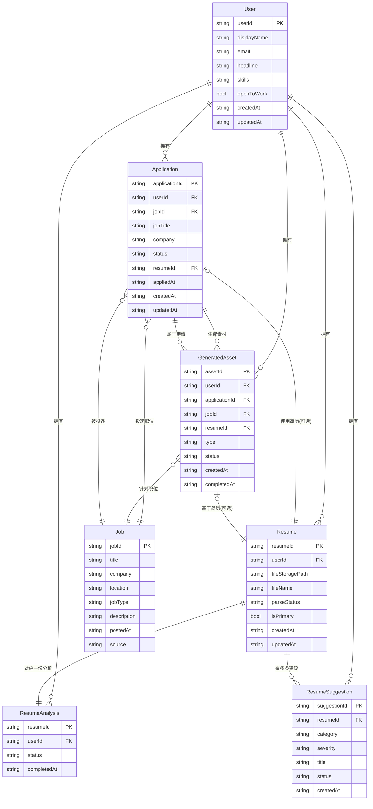
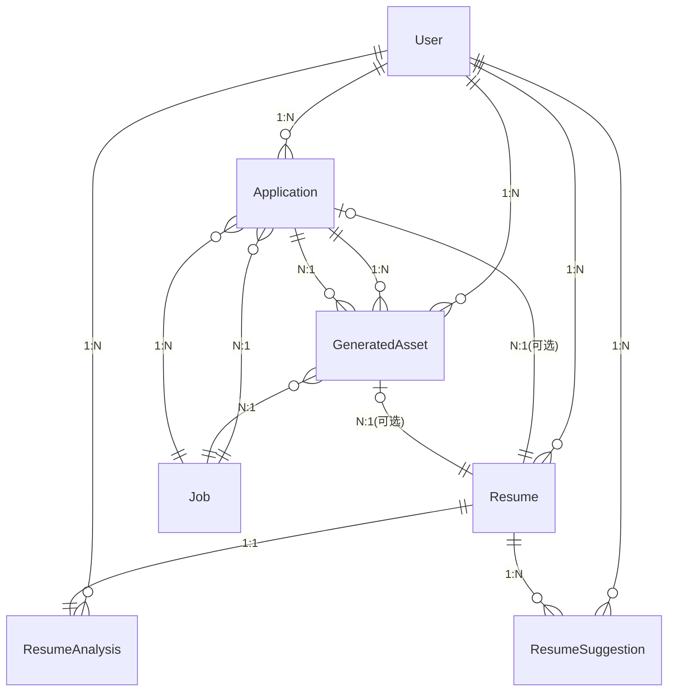
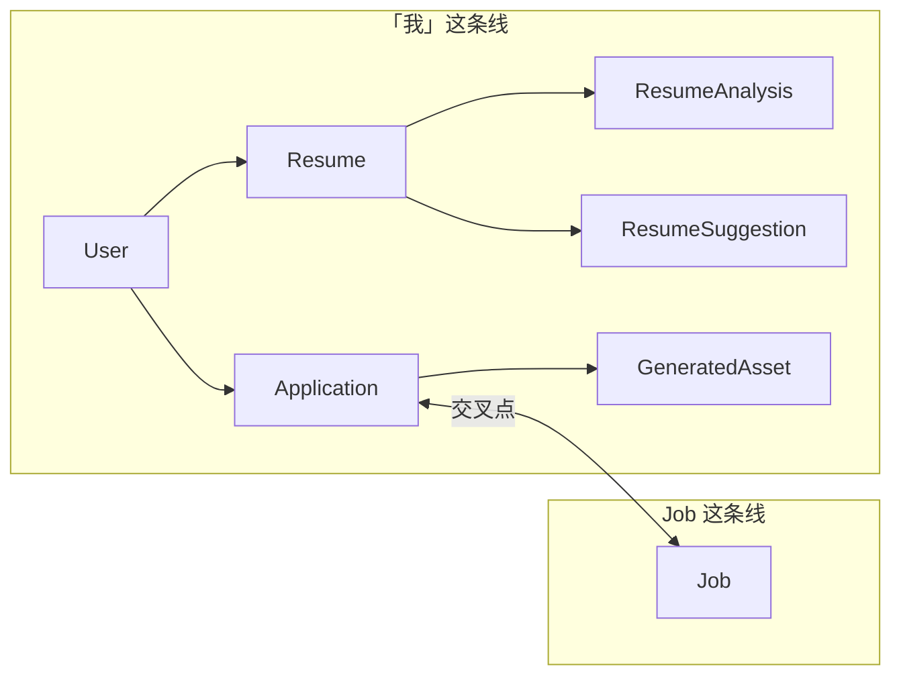

# ER 图（实体-关系图）

Job Application 数据模型。可在支持 Mermaid 的编辑器中渲染（如 VS Code、GitHub、GitLab）。

---

## 图一：实体与关系（含主要属性）

---

## 图二：仅实体与基数（简化版）

---

## 图三：两条线 + 交叉点（User 线 vs Job 线）

---

## 说明

- **PK**：主键；**FK**：外键（引用）。
- User 与各实体的 1:N 在存储上通过路径体现：`users/{userId}/resumes|applications|...`。
- Resume 与 ResumeAnalysis 的 1:1：analysis 文档 ID = resumeId。
- 带「可选」的关系：Application.resumeId、GeneratedAsset.resumeId 可为空。
